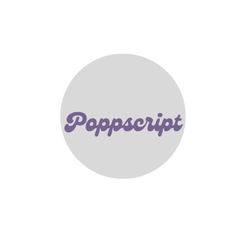
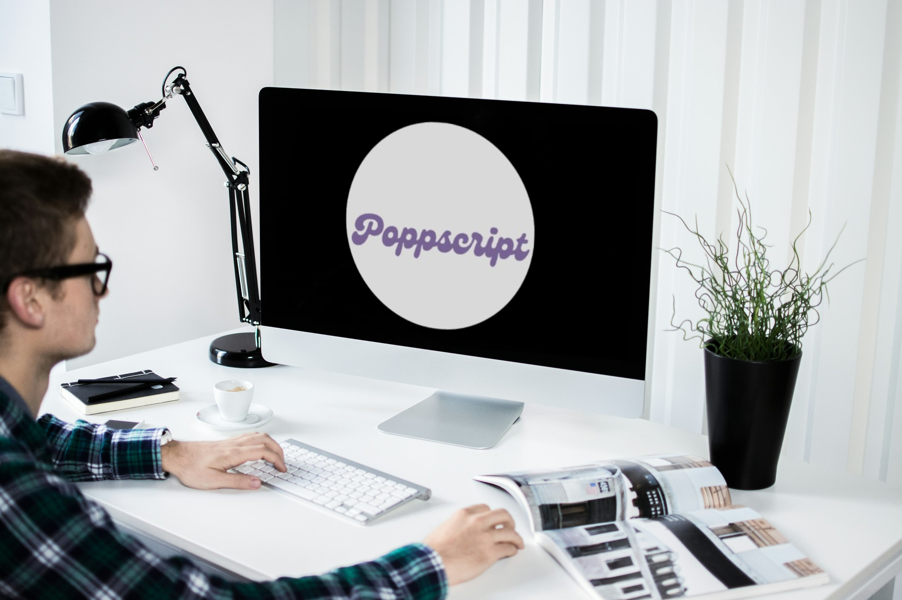

# Poppscript-Logo

# Poppscript Logo Design  

A professional logo design project for **Poppscript**, a business that sells acrylic 3D letters for walls.  
The logo features a bubbly, rounded, balloon-like script to reflect the playful and creative nature of the brand.  

---

## 🔥 Final Logo Previews  

### Website Logo  
  

### Circle Profile Logo (Instagram / Facebook)  
  

---

## 🎯 About the Brand  
Poppscript creates **custom acrylic letters** with a 3D balloon-style script.  
These letters are used for:  
- Wall decorations  
- Inspirational quotes  
- Personalized names  

The brand identity needed to feel **fun, modern, and welcoming**.  

---

## 🎨 Design Process  
1. Reviewed client requirements (bubbly, inflated script style).  
2. Explored multiple rounded typefaces and refined them for balance.  
3. Enhanced thickness to give an inflated, balloon-text effect.  
4. Designed two logo types:  
   - A full **website logo**.  
   - A simplified **circle profile logo** for social media.  

---

## 📦 Deliverables  
- ✅ Website Logo (PNG, SVG)  
- ✅ Social Media Circle Logo (PNG, SVG)  
- ✅ Mockups (Instagram & Website Previews)  
 

---

## 📸 Mockups  

### Instagram Profile Preview  
  

### Website Header Preview  
  

---

## 🛠️ Tools Used  
- **Adobe Illustrator** → vector design  
- ** Figma** → mockups  
- **GitHub** → project showcase  

---

## 👩‍💻 Author  
Designed by [Your Name](https://github.com/yourusername)  

---
